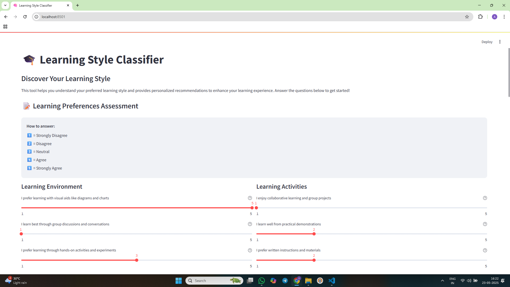

# Learning Style Classifier 🧠

This application helps classify students into different learning styles (Visual, Auditory, or Kinesthetic) based on their learning preferences and provides personalized learning recommendations.

## Demo Video
[](https://www.youtube.com/watch?v=pHgUnnYX9q0)

## Features

- Interactive web interface using Streamlit
- Machine learning model using Decision Trees
- Personalized learning recommendations
- Visual representation of learning style preferences
- Synthetic data generation for model training

## Installation

1. Clone this repository
2. Install the required dependencies:

```bash
pip install -r requirements.txt
```

## Usage

1. Run the Streamlit application:

```bash
streamlit run learning_style_classifier.py
```

2. Open your web browser and navigate to the provided local URL (usually http://localhost:8501)

3. Answer the questions about your learning preferences using the sliders (1-5 scale)

4. Click "Analyze Learning Style" to get your results

## How it Works

The application uses a Decision Tree Classifier trained on synthetic data to predict your learning style based on your responses to various learning preference questions. The model considers 10 different features related to learning preferences and classifies you into one of three categories:

- Visual Learner
- Auditory Learner
- Kinesthetic Learner

Based on your classification, the application provides personalized learning recommendations to help you optimize your learning experience.

## Features Used for Classification

1. Preference for visual aids
2. Enjoyment of discussions
3. Preference for hands-on activities
4. Memory of visual information
5. Learning from lectures
6. Enjoyment of group work
7. Learning from demonstrations
8. Preference for written instructions
9. Enjoyment of presentations
10. Enjoyment of experiments

## Contributing

Feel free to contribute to this project by:

1. Forking the repository
2. Creating a new branch
3. Making your changes
4. Submitting a pull request

## License

This project is licensed under the MIT License.
